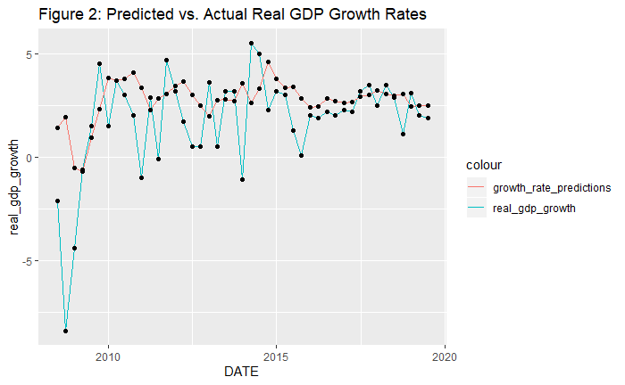

# US-Real-GDP-Prediction
US Real GDP Growth Prediction from Lagged GDP Growth & Spread Between 10-year Treasury Constant Maturity and 3-month Treasury Constant Maturity
author: "John Balzani"
date: "11/14/2019"

This is research to explore if US real GDP growth can be predicted from lagged GDP growth and the spread between the 10-year Treasury Constant Maturity yield and the 3-month Treasury Constant Maturity yield.

Abstract: There is research to support that the spread between long-term and short-term interest rates can predict future economic growth. The purpose of this research is to explore whether or not the difference between the 10-year Treasury Constant Maturity Yield and the 3-month Treasury Constant Maturity Yield (T10Y3M) is significant in predicting US real GDP growth in the following 4 quarters above the past values of real GDP growth itself. In particular, one of the purposes of this research is to explore if these predictions can be made accurately for the 2008 recession and current post-2008 recession business cycle. Different lagged values of T10Y3M and real GDP growth are tested in an Autoregressive Distributed Lag (ADL) model and this is compared to an Autoregressive (AR) model with 4 lags of real GDP growth. Data from 1983 - April 2008 are used to estimate the model, and data after that are used to evaluate the model performance. It is found that the 1-quarter and 2-quarter lagged values of real GDP growth and the 2-quarter lagged value of the difference between the 10-year Treasury constant maturity yield and the 3-month Treasury constant maturity yield are significant in predicting US real GDP growth from 1983-2008. However, these do not accurately predict US real GDP growth from July 2008 - July 2019, with a RMSE of 2.41% annualized quarterly real growth and a MAE of 1.61%. The model predicts the recession 2 quarters too late in late 2008, and does not fully capture the quarterly variability in annualized real GDP growth. During times of more stable economic growth, such as post-2015, the model is more accurate, with a RMSE and MAE of 1.19% and 0.89% respectively for this time period.

